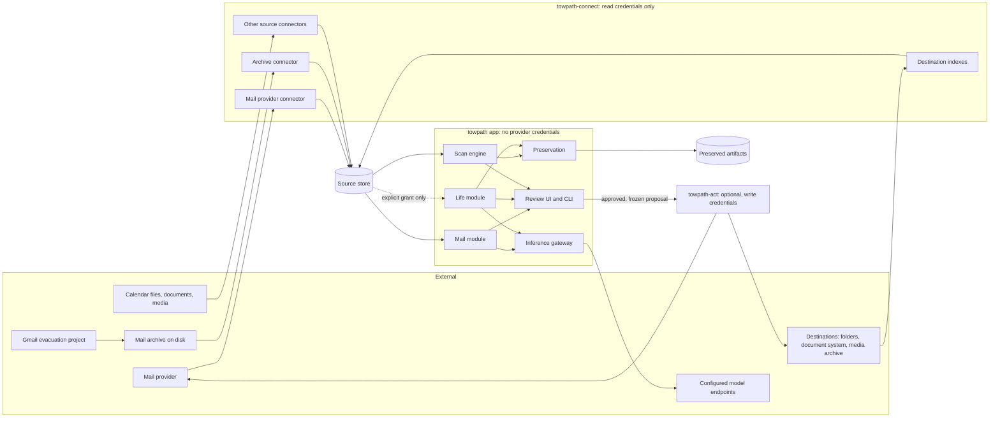

# Towpath architecture

Status: **designed, not built.** This document is the overview. Nothing described here exists as running code yet. Recommendations that still need the owner's agreement are listed in [decisions](decisions.md).

## Goal and the three concerns

Towpath builds tools to manage your digital life, starting with email, and uses that information to create an evidence-linked life summary.

| Concern | Purpose | Input | Output | Can change a live account? | Part of Towpath? |
| --- | --- | --- | --- | --- | --- |
| Mail management | Help people understand and handle mail that stays at Gmail or another provider, including finding items in it and routing them to other tools ([scans and destinations](scans-and-destinations.md)) | A mail provider read connector, or a mail archive read connector | Reports, classifications, exact action proposals | Only through an optional, separately permissioned executor, still undecided ([mailbox actions](mail-boundaries.md)) | Yes |
| Life summary | Turn selected sources into reviewable claims about people, events, places, and time | Any selected sources: recollections, calendars, documents, media metadata, and optionally mail | Claims with citations and uncertainty, timeline, questions, narratives | No | Yes |
| Personal Gmail evacuation | Preserve one person's historical Gmail in a local living archive and possibly remove provider copies | That person's accounts and backups | An archive and migration records | Yes, under its own process | **No.** Independent project; Towpath may read its archive through an [adapter](archive-adapter.md) |

Each Towpath capability is usable alone. Life summary must produce useful claims with no mail source configured. Mail management must be useful while mail remains at the provider indefinitely. Neither depends on the evacuation, and the evacuation does not depend on Towpath.

## System view

[Components](components.md) defines each deployable unit, which store it owns, and its permissions. [Interfaces](interfaces.md) defines the records that cross unit boundaries. [First slice](first-slice.md) defines the smallest build that tests this design with synthetic data.

## Design rules

1. **Credentials follow processes.** The process that parses untrusted mail and talks to models (the app) holds no provider or destination credential. Read credentials live only in the connector runner. Write credentials, if any ever exist, live only in the action runner.
2. **Index everything, fetch on demand.** With read access to a whole account, Towpath indexes every item's metadata and part structure and fetches content one item at a time when a rule, scan, or person needs it. Read access is not a copy.
3. **One connector per source, many consumers.** A mailbox is read once into the source store. Mail management and life summary consume it through separate, explicit grants. Connecting mail for management does not make it life-summary evidence.
4. **Occurrences, not merged messages.** Each copy of an item in each source is its own occurrence. Equal Message-IDs or hashes produce a recorded match with a strength, never a merge.
5. **Observations are dated.** Mailbox state (labels, folders, read status) is recorded as observed at a sync run. Disappearance is recorded as "absent since run N", never as deletion of history.
6. **Proposals, not actions.** Analysis and models produce proposals. Only a person produces an approval. Model output can never become an approval. Writing to another system (a destination) is an action too, even when it only adds files.
7. **Citations survive source changes, and valuable sources can be kept.** When a life-summary claim is accepted, the cited excerpt and its hash are captured so the claim stays reviewable after the provider copy is archived, moved, or deleted. A person can also preserve the whole message or an attachment as a content-addressed artifact with provenance, which is the foundation for a later archive package.
8. **No implicit model destination.** Every model call goes through the inference gateway, which requires an explicit endpoint profile, task binding, destination class, and data-class grant. No profile means the feature is off. See [model providers](model-providers.md).
9. **Rebuildable derivations.** Indexes, vectors, classifications, and model outputs can be regenerated. Human decisions (approvals, claim reviews, corrections) cannot and are stored as originals.

## Refinements to the first public design

The first public design was tested against the three-concern goal and the following boundaries changed:

| Earlier position | Problem found | Refinement |
| --- | --- | --- |
| Separate "mail read adapter" and "evidence adapters" | Two adapters would read the same mailbox with two credentials, and life summary could ingest all mail by default | One connector tier writes a shared source store; consumers need explicit grants |
| Executor holds a "narrowly scoped provider credential" | Gmail's API scopes that can apply labels or archive also permit reading and sending (to be verified, see [decisions](decisions.md#facts-to-verify-before-implementation)); IMAP passwords grant everything | Narrowness is enforced by process separation, an action allowlist configured at the executor, and frozen proposal digests, not only by provider scopes |
| Citations point to source items | A mailbox action or the evacuation can remove the cited provider copy | Capture excerpts on accept, optionally preserve the full item or attachment, and re-resolve citations through archive matches |
| Content retention as one global policy | "Find every PDF" and "find every photo" need access to all mail but not a copy of it | Index all items; fetch content per item on request; keep durable copies only by choice |
| Each feature that moves files elsewhere would be bespoke | Requests like "add these PDFs to my document system" would each need custom code and credentials | Generic selectors, destination connectors with separate read and write halves, and delivery as an approved action |
| Archive adapter "once the format is known" | Adapter shape was undefined, and the evacuation's tool may change | Read standard formats plus an optional manifest; the archive is read-only to Towpath; see [archive adapter](archive-adapter.md) |
| Provider/archive verification left vague | A Towpath report could be mistaken for deletion approval | Towpath may produce an advisory coverage report with match strengths; deletion decisions stay in the evacuation project |
| Mail and life deployability open | Unclear what "use one without the other" requires | One codebase, modules enabled per deployment, three process roles; see [components](components.md#usage-modes) |

## Public deployment contract

The application must run without Poundlock, a specific storage device, a particular mail archive, or private infrastructure. First installation configures storage; mail, other sources, and model endpoints are each optional. Capabilities that need an unavailable source, permission, or API route stay disabled with a stated reason. The [publication rules](publication.md) keep private data and deployment details out of this repository.
