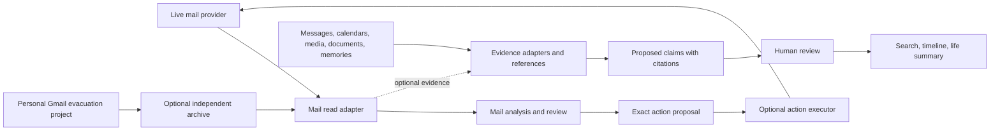

# Towpath architecture

Status: proposed boundaries for public review. This is a design document, not an implementation claim.

## The three concerns

| Concern | Purpose | Input | Output | Can change a live account? |
| --- | --- | --- | --- | --- |
| Mail management | Help people handle today's email | Provider read adapter or a chosen mail archive | Analyses and action proposals | Only through an optional, scoped action executor after review |
| Life summary | Recover and curate a personal history | Evidence adapters for mail, messages, calendars, photos, documents, memories | Search, timeline, claims, narratives | No |
| Personal mail evacuation | Preserve one person's historical Gmail independently, then decide whether to remove provider copies | Their accounts and backups | A local living archive and migration records | Yes, in that person's separate migration process |

Mail management must be useful while mail remains in Gmail or another provider. Life summary must work without email. People can run either Towpath capability alone, both together, or neither with the personal evacuation process. This preserves the option to keep mail at the provider if Towpath makes it useful there.

The dashed link is optional. The migration process is outside Towpath's application boundary. An archive integration reads a documented export or supported API and does not acquire authority to delete provider mail.

## Shared infrastructure, separate authority

Mail management and life summary may share a deployment, a job queue, an evidence reference format, and provider configuration. They keep separate write permissions and user-facing workflows. Shared storage does not imply that a life-history claim can trigger a mailbox action.

| Component | Responsibility | Authority |
| --- | --- | --- |
| Source adapters | Read from a provider, archive, or existing application; record source IDs, coverage, and acquisition time | Read credentials only |
| Evidence store | Preserve immutable input or stable references, source-specific occurrences, and hashes where bytes are held | Writes only its own storage |
| Analysis workers | Deterministic extraction first; model-backed proposals for ambiguous material | Read scoped evidence; write derived records |
| Review | Show source citations, uncertainty, conflicting evidence, and action details; record corrections | Changes derived decisions, not originals |
| Mail executor | Execute an approved, frozen proposal against one account and return a receipt | Narrow provider write credential; no authority over life claims |
| Narrative exporter | Produce a selected reading edition and its evidence links | Read only items released for that audience |
| Model provider adapter | Call an explicitly configured endpoint and record model/route metadata | No account or file-system mutation tools |

The [mail boundary](mail-boundaries.md) gives the executor flow. The [provider design](model-providers.md) defines the model contract. The [publication rules](publication.md) separate application code from a user's deployment.

## Evidence and claim contract

An evidence record identifies its source and namespace, original identifier, acquisition time, byte hash if archived, original time fields and timezone assumptions, content location, authorship, access policy, and coverage gaps. Equal Message-IDs or hashes do not collapse distinct account occurrences.

A claim is a statement about a person, event, place, relationship, or period. It stores a date expression and precision, evidence spans, producer and version, and proposed/accepted/rejected/superseded state. A message about an intended trip supports a *plan*; it does not by itself prove travel occurred. A person's recollection is attributed evidence, with its original wording and described period.

Derived indexes, vectors, summaries, and model outputs can be rebuilt. A correction remains attached to its evidence and survives a model change. Narratives cite accepted claims or attributed recollections and require release review before sharing.

## Public deployment contract

The application must run without Poundlock, a specific NAS, a particular mail archive, or private infrastructure. First installation should configure storage, a mail read adapter only if desired, and a model endpoint only if desired. Capabilities that need an unavailable API route stay disabled with a clear reason. No cloud destination is inferred from a model name.
