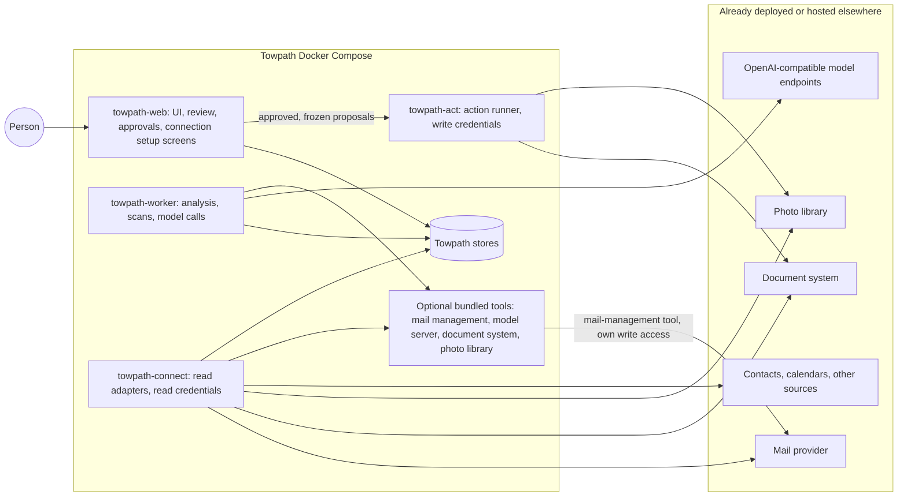

# Towpath architecture

Status: **design, partly built.** Read-only CLI roles and an optional local email UI exist. A full Gmail metadata index has completed in local acceptance; remaining live validation gates are tracked separately. Other adapters and workflows have synthetic/stub evidence as documented. The action runner, life stream and service Compose layout remain design. See the [vision](vision.md), [roadmap](roadmap.md) and [decisions](decisions.md).

## What Towpath is

Towpath is one self-hosted interface to discover a person's digital life, curate and reuse its contents, and build an evidence-linked timeline and portfolio. Sources include live accounts, local applications, files, exports, backups and recovered collections. Email is the first working source. Towpath connects existing specialist tools and adds the common references, relationships, collections, review and user interface. The [vision](vision.md) records the phased ownership direction.

| Capability | What a person does with it | Ownership |
| --- | --- | --- |
| Discovery and curation | Search connected sources, trace occurrences, distinguish versions and coverage, curate reference collections | Towpath owns references and owner decisions; source systems retain originals |
| Evidence-linked reuse | Assemble cited material for another workflow, such as a resume, portfolio or agent context packet | Consumers retain their own review, authorship and publication decisions |
| [Life stream](life-stream.md) | Connect people, projects, events, places and memories with evidence, uncertain dates and review | Towpath owns reviewed claims and recollections |
| [Mail management](mail-management.md) | Use an integrated tool for mailbox features and separately approved attachment deliveries | The tool retains its own access; Towpath deliveries use its action runner |

Discovery and life evidence can use any connected source. They do not require optional mail-management integration to be finished first. References and collections lead development; durable copies, source independence and physical organization are later phases under [ADR 0001](adrs/0001-reference-first-digital-life.md).

## Integrate first

Towpath writes code only where no suitable tool or library exists. For each need, the order of preference is:

1. **Connect to a tool the person already runs** (for example, an existing document system or photo library), by URL and credential.
2. **Bundle an existing open-source tool** in Towpath's Docker Compose file as an optional service.
3. **Use an existing library** inside Towpath (for example, a provider's official API client or a standard-library mail parser).
4. **Write Towpath code** for what remains: the user interface, the review and approval workflow, adapters, and the evidence and claim model.

[Integrations](integrations.md) lists candidate tools per need. Every entry is a candidate until its current behavior, license, and fit are verified.

Towpath does not own the originals held by connected tools. A photo stays in the photo library and a document stays in the document system; Towpath stores references to them, plus anything a person explicitly chooses to preserve.

## System view

Each external tool can be replaced by its bundled equivalent, or left out. [Components](components.md) defines the services, stores, credentials, and Compose layout. [Interfaces](interfaces.md) defines the records that cross service boundaries.

## Design rules

1. **AI proposes; evidence establishes.** Rules and models produce proposals. A fact is accepted only by a person, against cited evidence. A booking email supports "a trip was planned", not "the trip happened".
2. **Proposals, not actions, in Towpath.** Every change Towpath itself makes outside its own stores (for example a document upload) is a proposal until a person approves it, and only the action runner carries it out. Model output can never become an approval. An integrated tool, such as the mail-management provider, acts under its own settings, which the owner configures.
3. **Credentials follow services.** The service that parses untrusted content and calls models holds no account credential. Read credentials live in `towpath-connect`; Towpath's write credentials live only in `towpath-act`; an integrated tool keeps its own credentials in its own container. Each credential-holding service runs its own connection setup, so the web UI never handles the token.
4. **Index broadly, fetch narrowly.** With read access to a whole mailbox, Towpath indexes metadata and part structure and fetches content one item at a time when a feature needs it. Read access is not a copy. Providers do not always separate structure from content, so connectors must prove what they receive ([D16](decisions.md#d16-gmail-structure-without-content)).
5. **Reference what others own.** Photos, documents, and messages stay in their systems. Towpath stores stable references and, only by explicit choice, a preserved copy of evidence that might otherwise disappear.
6. **Audience and model use from the start.** Every item and claim has an audience (who may see it) and a model-use setting (where it may be processed), set independently. Items excluded from model use never go to a model, whatever endpoint grants exist ([life stream](life-stream.md#audience-and-model-use)).
7. **Human decisions are originals.** Approvals, corrections, accepted claims, and recollections (in their original wording, with attribution) are durable. Indexes, embeddings, classifications, and model outputs are rebuildable, and are never the only surviving copy of evidence.
8. **No implicit model destination.** Every model call uses an explicitly configured endpoint and data-class grant. See [model providers](model-providers.md).

## Not part of Towpath

**Operating a provider migration as an implicit part of indexing.** Discovery reads and references sources. Later ownership features may help a person preserve content and evaluate an independent local source, but transfers, provider retirement/deletion and recovery qualification remain separately scoped operational workflows. An existing local mail archive is an ordinary optional source. See [ADR 0001](adrs/0001-reference-first-digital-life.md).

**Replacing existing tools.** Towpath does not aim to be a document manager, photo library, mail server, or archive, and it uses an existing mail-management tool while that tool fits.

## Public deployment contract

Towpath must run without Poundlock, a specific storage device or model host, a mail archive, or any particular private infrastructure. A first installation starts the Towpath services; every connection, bundled tool, and model endpoint is optional and configured after login. Features whose connection or API route is unavailable stay disabled with a stated reason. The [publication rules](publication.md) keep private data and deployment details out of this repository.
