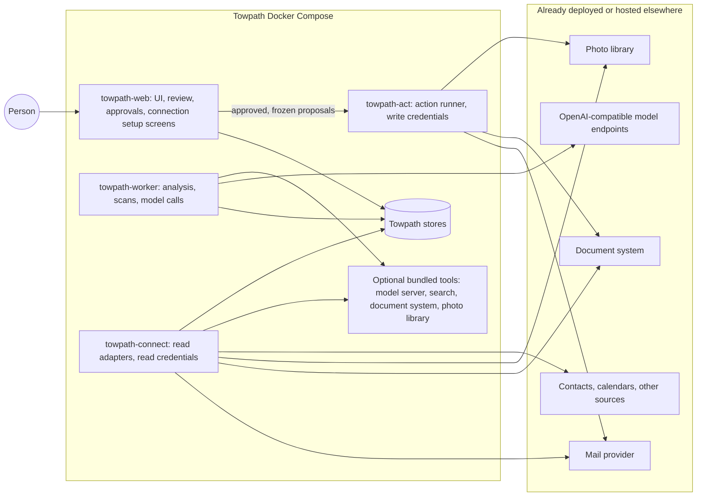

# Towpath architecture

Status: **designed, not built.** This is the overview. Nothing here exists as running code yet. Decisions and open questions are in [decisions](decisions.md).

## What Towpath is

Towpath is a self-hosted web application for managing your digital life, starting with email, and for building an evidence-linked life story from the sources you connect. You log in, connect accounts and tools, and work through reviewable suggestions. Towpath is the front end and the coordinator. Wherever a capable open-source tool already exists, Towpath connects to it instead of rebuilding it.

It has two capabilities that share one application:

| Capability | What a person does with it | First source | Changes anything outside Towpath? |
| --- | --- | --- | --- |
| [Mail management](mail-management.md) | Review unsubscribes, find important unanswered mail, draft replies, categorize, create smart rules, route attachments to the tools that should hold them | A Gmail account (more providers later) | Only approved actions, through the separate action runner |
| [Life stream](life-stream.md) | Find people, events, places, photos, and documents across connected sources; review claims with citations and uncertain dates; ask questions with cited answers; later, curate a story to share | Mail, then contacts, photo libraries, document systems, calendars, and recollections | No |

Mail management is useful on its own. The life stream is built after it and starts from mail, but its design does not depend on mail: any connected source can supply evidence.

## Integrate first

Towpath writes code only where no suitable tool or library exists. For each need, the order of preference is:

1. **Connect to a tool the person already runs** (for example, an existing document system or photo library), by URL and credential.
2. **Bundle an existing open-source tool** in Towpath's Docker Compose file as an optional service.
3. **Use an existing library** inside Towpath (for example, a provider's official API client or a standard-library mail parser).
4. **Write Towpath code** for what remains: the user interface, the review and approval workflow, adapters, and the evidence and claim model.

[Integrations](integrations.md) lists candidate tools per need. Every entry is a candidate until its current behavior, license, and fit are verified.

Towpath does not own the originals held by connected tools. A photo stays in the photo library and a document stays in the document system; Towpath stores references to them, plus anything a person explicitly chooses to preserve.

## System view

Each external tool can be replaced by its bundled equivalent, or left out. [Components](components.md) defines the services, stores, credentials, and Compose layout. [Interfaces](interfaces.md) defines the records that cross service boundaries.

## Design rules

1. **AI proposes; evidence establishes.** Rules and models produce proposals. A fact is accepted only by a person, against cited evidence. A booking email supports "a trip was planned", not "the trip happened".
2. **Proposals, not actions.** Every change outside Towpath (a label, a draft, a document upload) is a proposal until a person approves it, and only the action runner carries it out. Model output can never become an approval.
3. **Credentials follow services.** The service that parses untrusted content and calls models holds no account credential. Read credentials live in `towpath-connect`; write credentials live only in `towpath-act`. Each credential-holding service runs its own connection setup, so the web UI never handles the token.
4. **Index broadly, fetch narrowly.** With read access to a whole mailbox, Towpath indexes metadata and part structure and fetches content one item at a time when a feature needs it. Read access is not a copy.
5. **Reference what others own.** Photos, documents, and messages stay in their systems. Towpath stores stable references and, only by explicit choice, a preserved copy of evidence that might otherwise disappear.
6. **Audience and model use from the start.** Every item and claim has an audience (who may see it) and a model-use setting (where it may be processed), set independently. Items excluded from model use never go to a model, whatever endpoint grants exist ([life stream](life-stream.md#audience-and-model-use)).
7. **Human decisions are originals.** Approvals, corrections, accepted claims, and recollections (in their original wording, with attribution) are durable. Indexes, embeddings, classifications, and model outputs are rebuildable, and are never the only surviving copy of evidence.
8. **No implicit model destination.** Every model call uses an explicitly configured endpoint and data-class grant. See [model providers](model-providers.md).

## Not part of Towpath

**Moving mail out of a provider.** The owner may someday move historical Gmail into a local archive. That is a separate personal project with its own tools. Towpath never requires it, does not plan around it, and has no features for it. If someone later has a local mail archive, Towpath can read it as an ordinary optional source like any other ([integrations](integrations.md#sources)).

**Replacing existing tools.** Towpath does not aim to be a document manager, photo library, mail server, or archive.

## Public deployment contract

Towpath must run without Poundlock, a specific storage device or model host, a mail archive, or any particular private infrastructure. A first installation starts the Towpath services; every connection, bundled tool, and model endpoint is optional and configured after login. Features whose connection or API route is unavailable stay disabled with a stated reason. The [publication rules](publication.md) keep private data and deployment details out of this repository.
