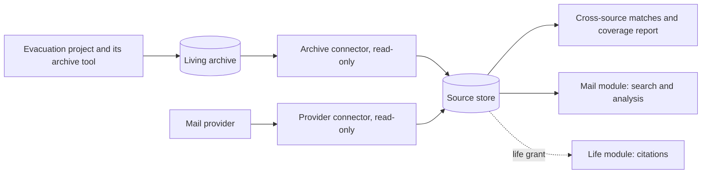

# Optional mail archive adapter

Status: **designed, not built.** Towpath reads standard mail files plus an optional manifest, so it does not depend on which archive tool the independent Gmail evacuation chooses.

## Where it fits

The archive adapter is a source connector of kind `mail-archive` inside `towpath-connect` ([components](components.md)). It reads files or a local read-only service. It holds no provider credential, writes nothing to the archive, and writes only to Towpath's source store.



An archive source supports three uses, all optional:

1. **Mail management over the archive.** Search, triage reports, and sender analysis on mail that no longer lives at a provider. No actions: there is no account to change.
2. **Life-summary evidence.** With a life grant, archived mail can support claims. Citations stay valid after provider copies are gone.
3. **Advisory coverage.** When both a provider source and an archive source exist, Towpath reports ([D7](decisions.md#d7-coverage-report-home), accepted) which provider occurrences have archive matches and at what strength ([interfaces](interfaces.md#coverage-report)).

None of these is required for Towpath to work, and the evacuation does not need Towpath.

## Input options

| Option | What the adapter reads | Strengths | Weaknesses |
| --- | --- | --- | --- |
| 1. Standard files | Maildir, mbox, or a directory of `.eml` files | Tool-independent; easy synthetic fixtures; survives archive-tool changes | Loses provider IDs, labels, and acquisition time unless headers carry them |
| 2. Standard files plus manifest | Option 1 plus a JSON Lines manifest: one row per message with file path, provider account and native ID, labels at capture, capture time, raw hash | Keeps provenance needed for matching and citations; still tool-independent | The archive tool or a small export script must write the manifest |
| 3. Archive tool's own database or API | The tool's index, database, or HTTP API | Richest metadata, no duplicate export | Couples Towpath to one tool's internal format and version |
| 4. Local IMAP served by the archive | Reuse the IMAP connector against a local server | No new code path | Provenance depends on the server preserving headers; adds a running service |

**Decision ([D4](decisions.md#d4-archive-input), accepted):** implement option 1 first (it is also the synthetic test path) and option 2's manifest as a small public schema. Option 3 is not planned; option 4 remains possible through a future IMAP connector.

### Draft manifest row

```json
{"schema": "towpath.archive-manifest/0", "path": "cur/1700000000.fx42.example:2,S", "account": "synthetic-a@example.com", "native_id": "fx-a-000042", "labels": ["INBOX", "Newsletters"], "captured_utc": "2026-09-30T08:00:00Z", "raw_sha256": "3b1f…"}
```

Some provider exports include labels in a header; when present, the adapter records it as an observed state at capture time.

## Living archive behavior

The archive changes as new mail is appended. The adapter scans incrementally by manifest sequence when available, otherwise by path, size, and modification time, confirming with hashes. A file that disappears is recorded as absent, like any other source item. A file whose bytes change under the same path is recorded as a new occurrence with a `conflict` match, never silently replaced.

## What the adapter does not do

- It does not decide that provider mail is safe to delete. Coverage reports are labeled advisory.
- It does not import mail into Towpath as a new archive of record. Towpath's content cache follows the retention policy and is not a backup.
- It does not require the archive to exist before Towpath's provider-based mail management or life summary can be used.

## Remaining questions

- Whether the evacuation's chosen tool writes Maildir or mbox directly, or needs an export step and a manifest writer. That is the evacuation's choice; Towpath's input is fixed by [D4](decisions.md#d4-archive-input).
