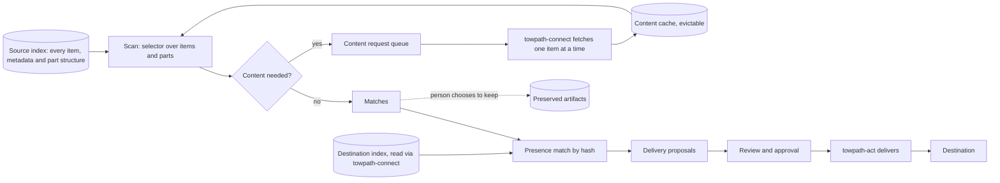

# Scans, destinations, and preserved artifacts

Status: **designed, not built.** This generalizes requests such as "find every photo in my mail and add it to my photo library" or "find every PDF that is not already in my document system and add it there" into one connector pattern. Destinations are existing tools, such as a document system or photo library the person already runs or one bundled in Compose ([integrations](integrations.md)). Each is an adapter; the scan engine never knows about a particular product.

## The pattern



1. **Index everything, fetch on demand.** With read access to the whole account, `towpath-connect` indexes every message's metadata and MIME part structure (type, size, file name, part ID), but downloads bodies and attachments only when a scan or a person needs them.
2. **A scan** runs a selector over the index, requests content it needs, and records matches. Scans are resumable, rate-limited, and report coverage like a sync does.
3. **A destination connector** has a read half that indexes what the destination already holds and a write half, in the action runner, that delivers.
4. **Delivery is an action.** Adding a file to another system is a write to that system, so it follows the same propose, approve, execute path as a mailbox action, with its own credential held only by `towpath-act`.
5. **Preservation is a separate choice.** Any matched item, part, or cited source can be copied into the preserved-artifact store, independent of delivery.

## Selectors

A selector is declarative so it can be reviewed, saved, and rerun. Version 0 fields:

```json
{
  "schema": "towpath.selector/0",
  "selector_id": "sel_pdf_attachments",
  "sources": ["src_fixture_a"],
  "item": {"date_from": "2015-01-01", "from_domain_not": ["news.example.com"]},
  "part": {"media_type_any": ["application/pdf"], "min_bytes": 1024, "disposition": "attachment"},
  "classifier": null
}
```

`classifier` is an optional task name (for example `doc.is_statement`) run through the [inference gateway](model-providers.md) on each candidate. Without a bound endpoint it is skipped and the scan reports that the selector ran without it.

## Destination connectors

A destination has two halves, so neither web nor worker holds its credential:

| Half | Runs in | Interface | Credential |
| --- | --- | --- | --- |
| Read | `towpath-connect`, as an ordinary [source connector](interfaces.md#1-source-connector-inside-towpath-connect) of kind `document-system` or `photo-library` | `enumerate` returns what the destination already holds, with hashes where available | Destination read access only |
| Write | `towpath-act` | `deliver(artifact, metadata) -> destination ID and receipt` | Destination write access only |

"Is this already there?" is then an ordinary cross-source match between a scan's candidate part and the destination index, by SHA-256 of the exact bytes. When a destination cannot report hashes, the match is `unknown` and Towpath falls back to its own delivery ledger, so the same file is not proposed twice. A destination index is refreshed like any sync, so presence is an observation at a run, not a guarantee.

| Destination kind | Read half | Write half | First? |
| --- | --- | --- | --- |
| Folder | Hash the directory's files | Write the file plus a JSON sidecar into a directory another tool watches or imports | First, because it needs no third-party API and suits synthetic tests |
| Document system API | List documents with checksums | Upload with metadata | Next; candidate in [integrations](integrations.md#documents) |
| Photo library API | List assets with checksums | Upload | Next; candidate in [integrations](integrations.md#photos) |

The same connection serves the life stream: a document system or photo library connected as a destination is also an evidence source, read through its own grant. Towpath stores the destination's IDs as references and never takes over its originals.

### Delivery proposal

```json
{
  "schema": "towpath.delivery.proposal/0",
  "proposal_id": "dprop_0003",
  "destination_id": "dst_documents_folder",
  "scan_id": "scan_0011",
  "items": [
    {"occurrence_id": "occ_0071", "part_id": "2", "file_name": "statement-2024-03.pdf",
     "sha256": "5e7c…", "presence": "absent",
     "metadata": {"source_date": "2024-03-04", "from_domain": "bank.example.com"}}
  ],
  "created_at": "2026-10-01T12:20:00Z"
}
```

Approval and receipt records match the [mail proposal records](interfaces.md#3-mail-proposal-approval-and-receipt), with `result` values `delivered`, `skipped-present`, and `failed`.

## Preserved artifacts

The preserved-artifact store keeps exact bytes chosen for long-term value, with provenance. It is distinct from the content cache, which can be evicted, and from any destination, which Towpath does not control.

| Preservation level | What is kept | Typical use |
| --- | --- | --- |
| `excerpt` | The cited text span and its hash | Default for an accepted claim |
| `part` | One attachment or body part, exact bytes | A photo or PDF that matters |
| `item` | The full raw message, including all parts | A message that is itself a record, such as a letter |

A person chooses the level when accepting a claim, from a scan result, or from any item view. Rules can propose preservation; only a person confirms it.

```json
{
  "schema": "towpath.artifact/0",
  "artifact_sha256": "5e7c…",
  "media_type": "application/pdf",
  "bytes": 48213,
  "level": "part",
  "provenance": [
    {"occurrence_id": "occ_0071", "source_id": "src_fixture_a", "native_id": "fx-a-000071",
     "part_id": "2", "fetched_run": "run_0012", "verified_against": "raw_sha256"}
  ],
  "preserved_by": "local-user",
  "preserved_at": "2026-10-01T12:25:00Z",
  "reason": "Cited by clm_0019"
}
```

Artifacts are content-addressed: the same bytes from two sources are stored once, with two provenance entries. Before storing, worker verifies the bytes against the hash `towpath-connect` recorded when it fetched them.

### Foundation for a future archive package

The preserved-artifact store is designed so a later revision can export everything a person chose to keep as one self-describing package: artifact files, provenance, claims with citations, and a manifest, in an open directory format (a [BagIt](https://www.rfc-editor.org/rfc/rfc8493)-style layout is one candidate). That future tool is not designed here. It is recorded so today's schemas (content addressing, provenance per occurrence, preservation level) do not need to change for it. It is a way to keep chosen evidence, not a mail migration tool.

## Boundaries

- Scans and presence checks are read-only. Only `towpath-act` writes to a destination or a mailbox.
- A delivery never removes or changes the source mail. "Add PDFs to my document system and then archive the messages" is two proposals, each approved separately.
- A scan over a mail source needs that source's `mail` grant; a scan feeding life-stream evidence needs a `life` grant.
- Destination plugins are untrusted with respect to each other: each has its own credential and allowlist entry in `towpath-act`.
